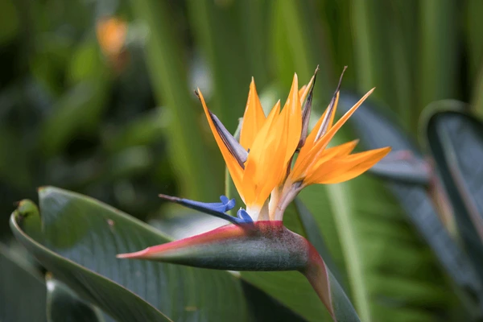

# Bird Of Paradise

- **Common name**: Bird of Paradise 
- **Scientific name**: Strelitzia Reginae
- **Size**: 3 to 5 feet tall
- **Geographic location**: South Africa
- **Culture**: Bird-of-paradise grows in most soils, but does best in firtile, organic soils with good drainage. 
- **Care and maintenance**: Once established, bird-of-paradise prefers frequent watering from rain or irrigation during the warm growing season. During the winter months, plants should be watered only when the soil is fairly dry. For good flower production, place plants in sunner or partially shaded locations. 

## Image

