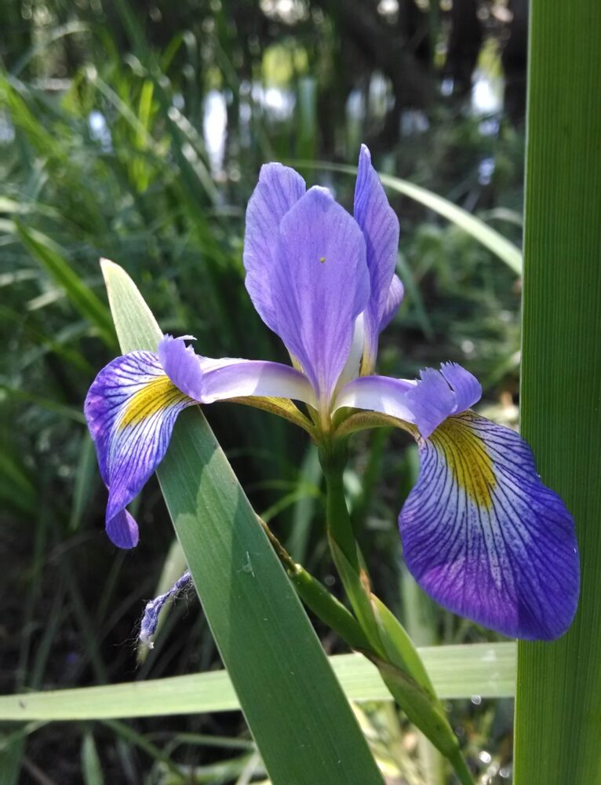

# Blue Flag Iris

- **Common name**: Blue Flag Iris  
- **Scientific name**: Iris Versicolor
- **Size**: Up to 2 feet tall
- **Geographic location**: Native or Northeastern woodlands and streams in North America. 
- **Culture**: Prefer to be moise. Surround with two inch layer of mulch to help retain moisture. Full sun to partial shade. 
- **Care and maintenance**: Do best in highly organic soil. 

## Image

<!-- Add an image of the plant below. For example:

-->
