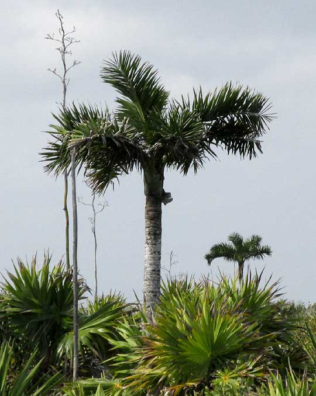

# Plant 3

- **Common name**:
- **Scientific name**:
- **Size**:
- **Geographic location**:
- **Culture**:
- **Care and maintenance**:

## Image

<!-- Add an image of the plant below. For example:

-->
