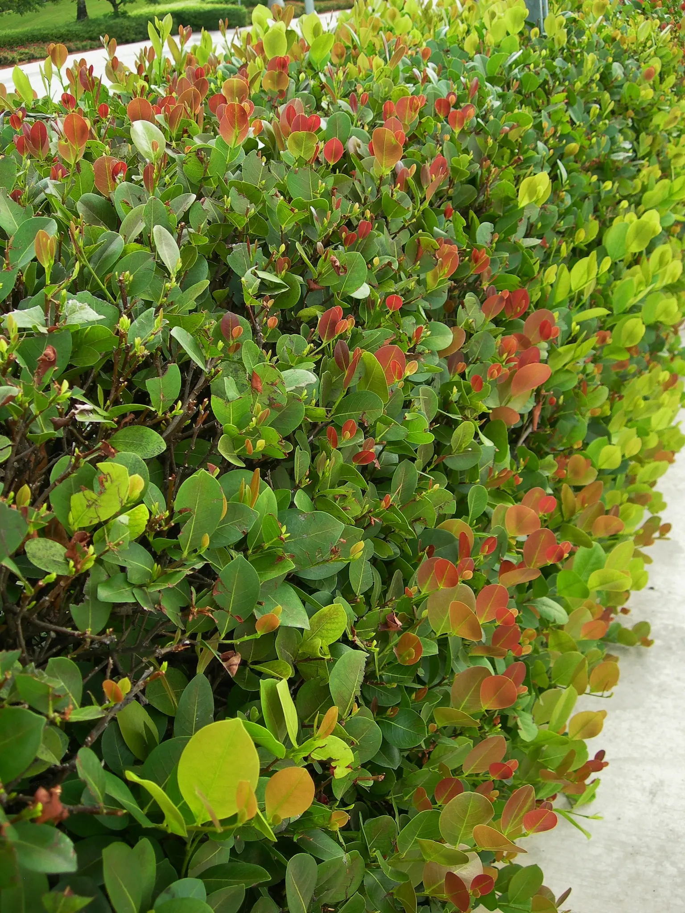

# Coco Plum

- **Common name**: Coco Plum
- **Scientific name**: Chrysobalanus Icacoa
- **Size**: Up to 30 feet, usually 10-12 feet plus a 8 foot shrub. 
- **Geographic location**: Native to Coastal Central Florida and Southern Florida.
- **Culture**: Sandy loam, sunny exposure, and good drainage. 
- **Care and maintenance**: Fertilize well once a year. Requires little moisture once established. Stands pruning and shearing well. 

## Image

