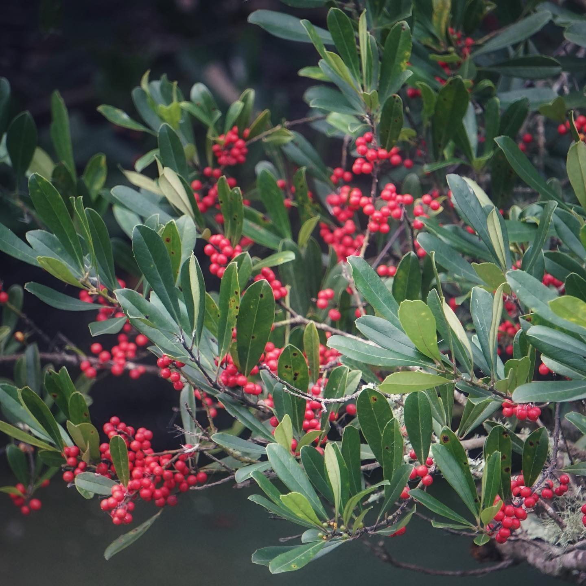

# Dahoon Holly

- **Common name**: Dahoon Holly
- **Scientific name**: Ilex cassine
- **Size**: 20-50 feet
- **Geographic location**: Native from Florida Keys to Virginia and Louisiana.
- **Culture**: Favors wet marginal land, swamps, and stream banks. Can tolerate drier conditions with watering.
- **Care and maintenance**: Clippinng only required if used as a foundation plant due to its tendency to grow upwards of 20 feet. No special fertilization required. 

## Image

<!-- Add an image of the plant below. For example:

-->
