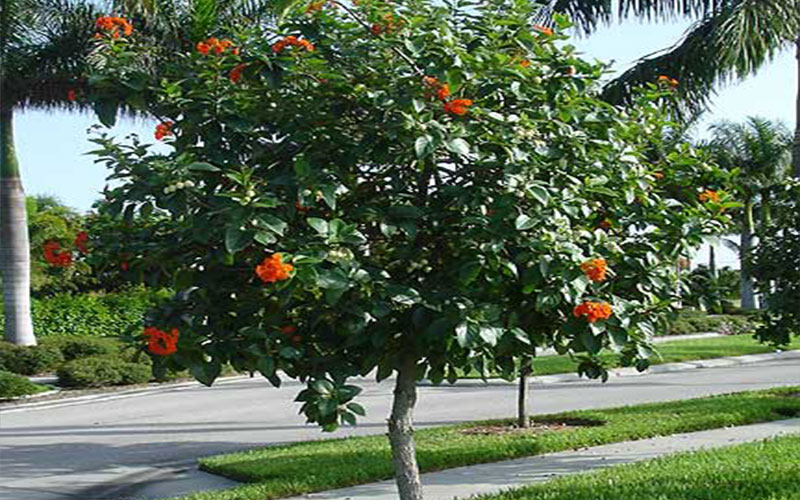

# Geiger Tree

- **Common name**: Geiger Tree
- **Scientific name**: Cordia Sebestena 
- **Size**: 30x15 feet
- **Geographic location**: Native to South Florida, Bahamas, Caribbean, and South America.
- **Culture**: Sandy soils under dry conditions, full sun, and salt resistant. 
- **Care and maintenance**: No soil amendments are needed for this tree. Water regularly after planting, and during dry spells once it's established. Cut it back in spring (late March or early April) to keep it the size you want, and trim branch ends during warm weather to promote bushiness. Fertilize three times a year - once in spring, summer, and autumn - with good quality granular fertilizer. 

## Image

<!-- Add an image of the plant below. For example:

-->

