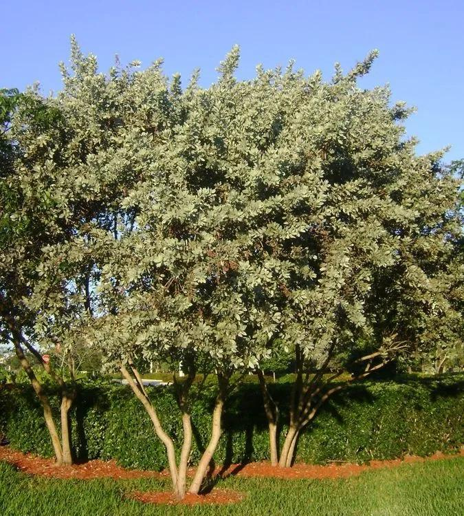

# Green Buttonwood 

- **Common name**: Green Buttonwood
- **Scientific name**: Conocarpus Erectus
- **Size**: 20 to 40 feet tall.
- **Geographic location**: Bermuda, both coasts of South Florida, Bahamas, Carribean, Mexico, Central & South America, and the Galapagos Islands. 
- **Culture**: High drought tolerance, can tolerate occasional to frequent wet soils. 
- **Care and maintenance**: A tough long-lived plant that grows well in sandy or rocky, alkaline soils, as well as wet, saline conditions. It is well suited for difficult urban situations and is highly recommended for seaside plantings. Plant it in full sun or partial shade, but it is not tolerant of dense shade. It requires no irrigation except in the driest sites. 

## Image

<!-- Add an image of the plant below. For example:

-->
