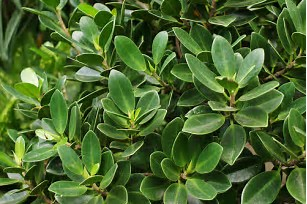

# Green Island Ficus

- **Common name**: Green Island Ficus
- **Scientific name**: Ficus microcarpa
- **Size**: About 3 feet
- **Geographic location**: South Florida
- **Culture**: Drought and salt tolerant.
- **Care and maintenance**: Full sun to partial shade. Water during dry spells, but allow to dry out between waterings. 

## Image

<!-- Add an image of the plant below. For example:

-->

