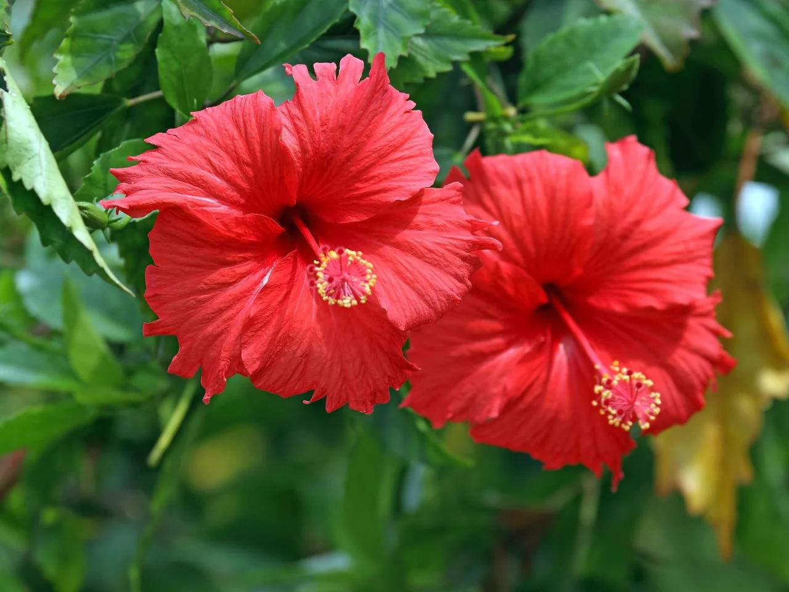

# Hibiscus

- **Common name**: Hibiscus 
- **Scientific name**: Hibiscus Rosa-sinesis
- **Size**: 10 to 15 feet high.
- **Geographic location**: Native to South Florida, Bahamas, Carribean, from Mexico through Central America down to Venezuela and Columbia. 
- **Culture**: Can be grown year round, but will not tolerate freeze.
- **Care and maintenance**: Rich, well draining soil and full sun. Feritlize lightly and often. Prune late summer/early fall to protect from cold temps. 

## Image

<!-- Add an image of the plant below. For example:

-->

