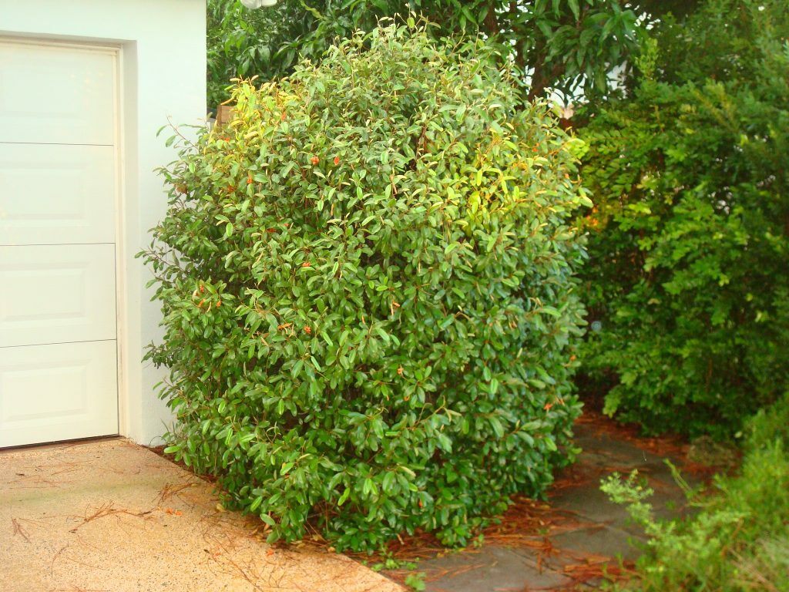

# Jamaica Caper

- **Common name**: Jamaica Caper
- **Scientific name**: Capparis Cynophallophora
- **Size**: Up to 20 feet.
- **Geographic location**: Natice South Florida, West Indies, Mexico, South and Central America. 
- **Culture**: Sun to deep shade with good drainage. Drought resistant. 
- **Care and maintenance**: Requires little care. Reacts beautifully to fertilizer. 

## Image

<!-- Add an image of the plant below. For example:

-->
