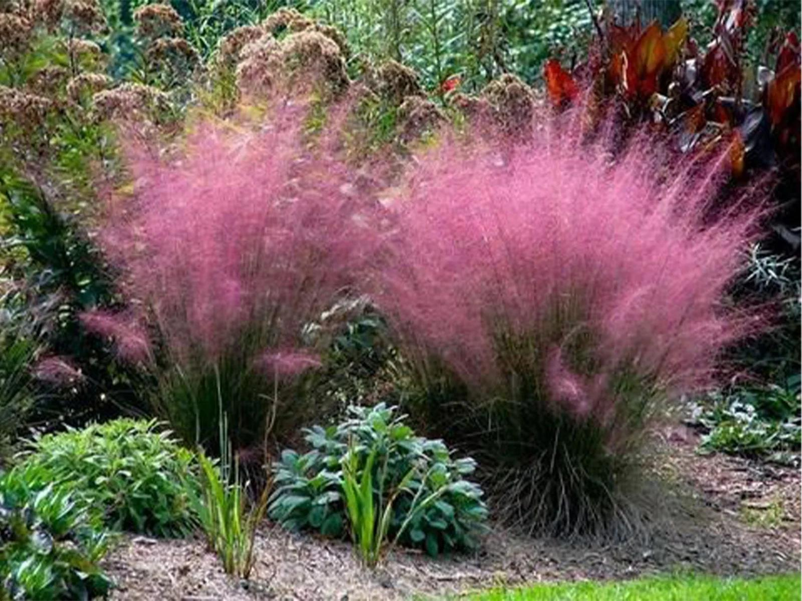

# Muhly Grass

- **Common name**: Muhly Grass
- **Scientific name**: Muhlbergia
- **Size**: 3 to 4 feet tall
- **Geographic location**: Native to Florida and Eastern United States.
- **Culture**: Any soil as long as it drains well.
- **Care and maintenance**: Thrives on neglect, water during severe drought. Can be cut back once only in early spring.

## Image

<!-- Add an image of the plant below. For example:

