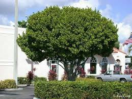

# Pigeon Plum

- **Common name**: Pigeon Plum
- **Scientific name**: Coccoloba Diversifolia
- **Size**: 20 to 50 feet.
- **Geographic location**: Native Florida, Bahamas, and West Indies. 
- **Culture**: Semi shade to sunny.
- **Care and maintenance**: Clipping required for strong structure. No special fertilization required. 

## Image

<!-- Add an image of the plant below. For example:

-->
