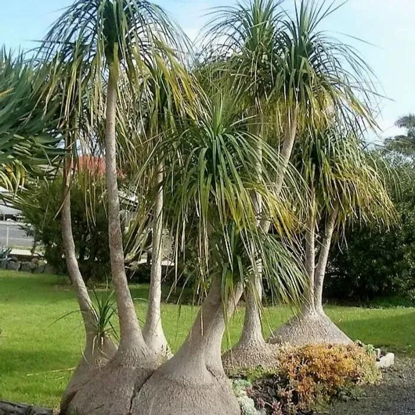

# Ponytail Palm

- **Common name**: Ponytail Palm
- **Scientific name**: Beaucarnea recurvata 
- **Size**: 6 to 18 feet tall
- **Geographic location**: Mexico
- **Culture**: Dry, sandy mix soil.
- **Care and maintenance**: Bright light with semi dry conditions. Soil should completely dry out between waterings. 

## Image

<!-- Add an image of the plant below. For example:

-->
