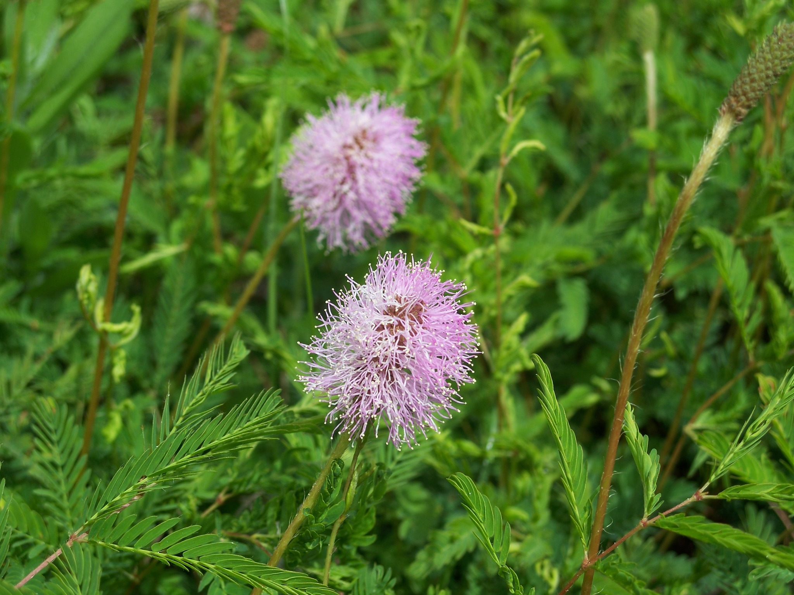

# Powderpuff Mimosa 

- **Common name**: Powderpuff Mimosa 
- **Scientific name**: Mimosa Strigillosa
- **Size**: Up to 2 feet tall
- **Geographic location**: Native or Northeastern woodlands and streams in North America.
- **Culture**: Full sun to partial shade. Drought tolerant. 
- **Care and maintenance**: Tolerates periodic pruning if necessary. 

## Image

<!-- Add an image of the plant below. For example:

-->

