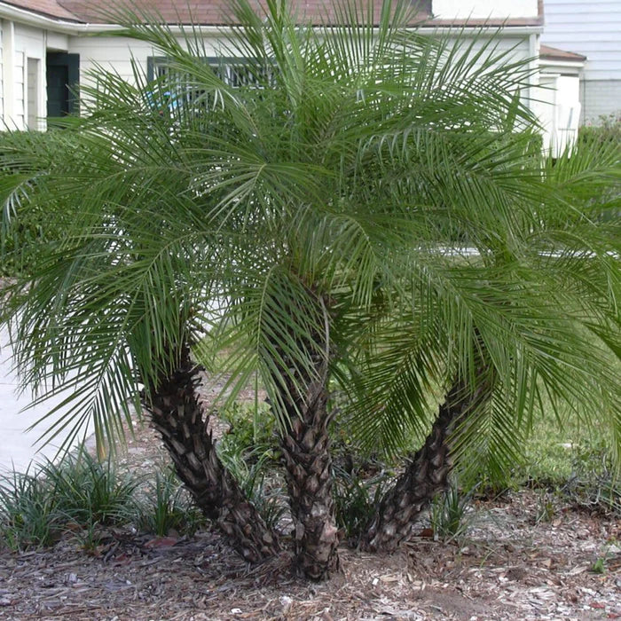

# Pygmy Date Palm

- **Common name**: Pygmy Date Palm
- **Scientific name**: Pheonix Roebelenii
- **Size**: 9 by 6 feet. 
- **Geographic location**: Burma, Central and South Florida. 
- **Culture**: Any of several fertile soils with good to moderate drainage. Requires moisture. Prefers shade or some sun.
- **Care and maintenance**: Likes consistently moist soils, but do not leave in standing water. Fertilize 2-3 times a year with a fertilizer labeled for use with palms. Only remove fronds when they have turned brown. No pruning. 

## Image

<!-- Add an image of the plant below. For example:

-->

