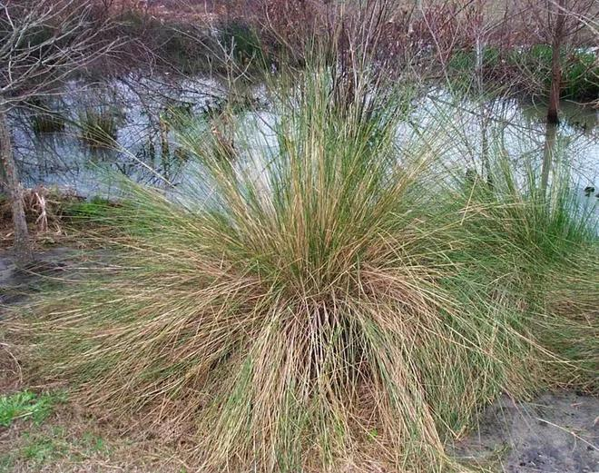

# Sand Cordgrass

- **Common name**: Sand Cordgrass
- **Scientific name**: Spartina Bakeri
- **Size**: 2-4 feet, even wider spread. 
- **Geographic location**: From South Florida to the Carolinas. 
- **Culture**: Full sun with drought tolerance. 
- **Care and maintenance**: Does not require any special care. Does not require pruning. 

## Image

<!-- Add an image of the plant below. For example:

-->

