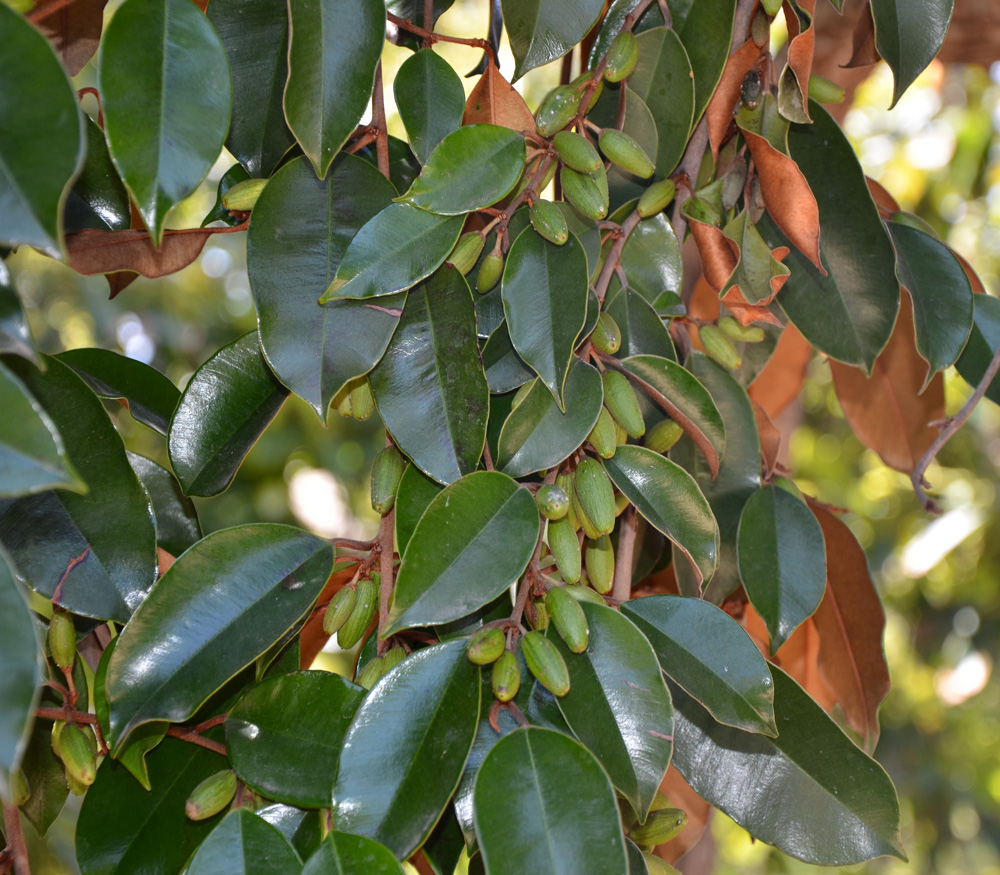

# Satin Leaf

- **Common name**: Satin Leaf
- **Scientific name**: Chrysophyllum Oliviforme
- **Size**: 30 feet by 15-20 feet. 
- **Geographic location**: South Florida and the West Indies. 
- **Culture**: Moist marl to sandy loam wiht full sun.
- **Care and maintenance**: Prefers slightly acidic soils and fertilizer. Once it is a large specimen, consistent mulching is sufficient. 

## Image

<!-- Add an image of the plant below. For example:

-->
