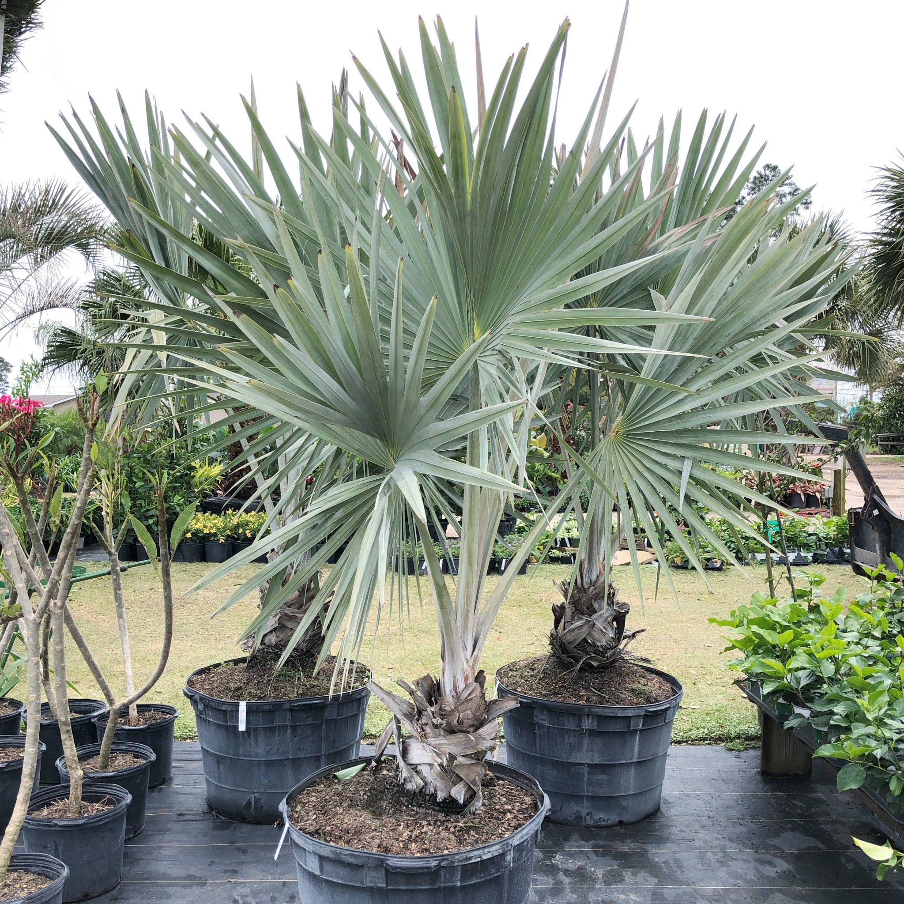

# Silver Palm

- **Common name**: Silver Palm
- **Scientific name**: Coccothrinax Argentata
- **Size**: 6-10 feet
- **Geographic location**: Florida
- **Culture**: High salt and drought tolerance.
- **Care and maintenance**: Average water needs. 

## Image

<!-- Add an image of the plant below. For example:

-->
