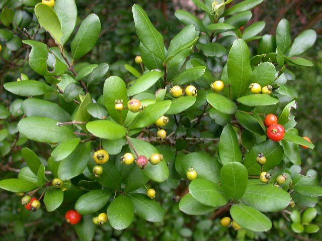

# Simpson's Stopper

- **Common name**: Simpson's Stopper
- **Scientific name**: Myrcianthes fragrans
- **Size**:20-30 feet high and 15-20 feet wide. 
- **Geographic location**: South Florida, Bahamas, Carribean, Mexico through Cental America down to Venezuela and Colombia.
- **Culture**: High salt and drought tolerance. 
- **Care and maintenance**: Well drained and occasionally wet soil. Medium-high light. 

## Image

<!-- Add an image of the plant below. For example:

-->

