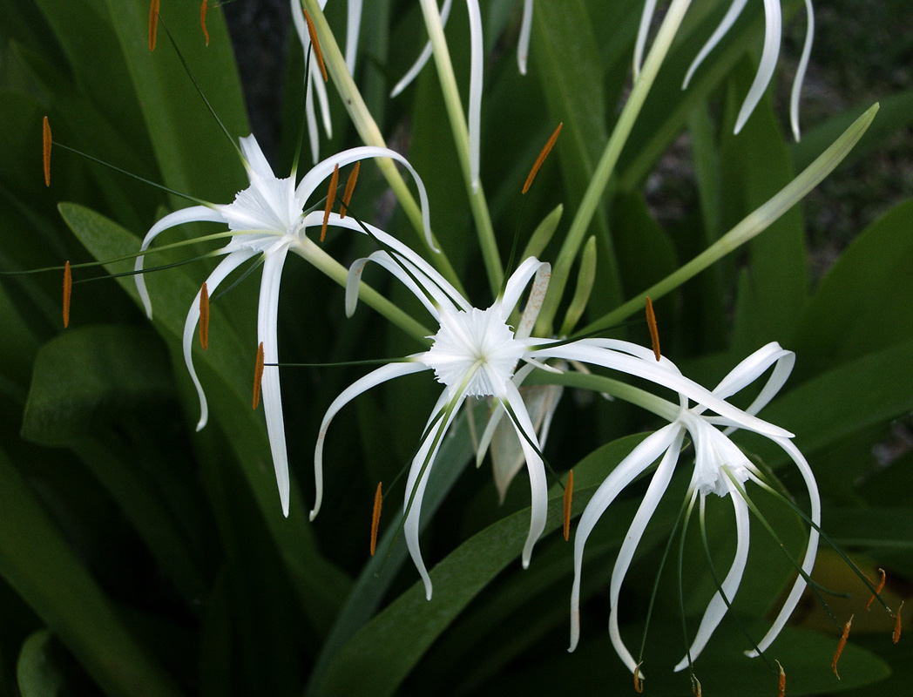

# Spider Lily

- **Common name**: Spider Lily
- **Scientific name**: Hymenocallis latifolia
- **Size**: 2 by 5 feet
- **Geographic location**: Native to Florida coast from Melbourne to the Keys.
- **Culture**: Sandy loam to full beach sand. Full sun with average to light moisture.
- **Care and maintenance**: Prefer well drained, slightly alkaline soil. 

## Image

<!-- Add an image of the plant below. For example:

-->

