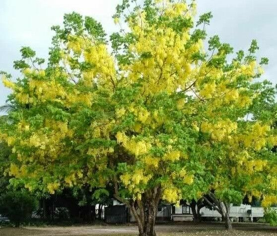

# Verawood

- **Common name**: Verawood
- **Scientific name**: Bulnesia arborea
- **Size**: 30 by 40 feet
- **Geographic location**: South Florida.
- **Culture**: Drought and salt tolerant.
- **Care and maintenance**: Full sunlight with well draining soil.

## Image

<!-- Add an image of the plant below. For example:

-->
